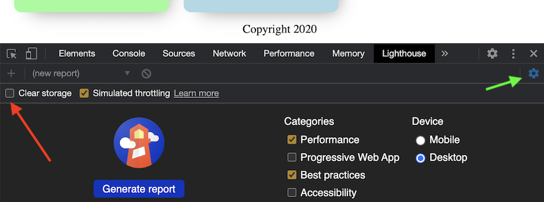

# Using Lighthouse

Here are some hints to use [Lighthouse](https://developers.google.com/web/tools/lighthouse) to better understand your web app's performance.

## Chrome DevTools

If you use Google Chrome, Lighthouse is already built in.

1. Open Chrome on the web page (either local, `npm run prod:serve` or a deployed app).
2. DevTools > `Lighthouse`
3. Click ⚙️ > Unselect `Clear storage`. Otherwise running Lighthouse will log you out.[^1-refs]

   >

4. `Generate report`

[^1-refs]: Found by: [Question: How to test page behind authentication?](https://github.com/GoogleChrome/lighthouse/issues/1418) - thanks `@fdn`!!

This way we can get real results.

91% 💃🕺

Then learn to:
- analyze trace

### Firebase hosting emulator does not do HTTP/2 

>

While running Firebase locally may give you some confidence, you should really run it against the deployed application.

Firebase hosting *does* provide HTTP/2 but only in the cloud. The emulator (as of 8.10.0) does not.

<!-- tbd. Once we see deployment characteristics (HTTP/2 vs. HTTP/1.1), list here.
-->

<!-- tbd. use Lighthouse from command line
-->

## References

- [Running Lighthouse on Authenticated pages](https://github.com/GoogleChrome/lighthouse/blob/master/docs/authenticated-pages.md) (Lighthouse GitHub)

