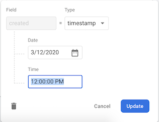

# Wishes for Firebase

Dear Firebase. You are awesome. If you ever run out of things to improve, here would be some ideas:

## Cloud Firestore

### Ability to insert "current server date" in the Firebase console (and Rules simulator)



<!--
<strike>The dialog could have a "right now" or "server date" button, like the API allows a client to set a field to current date.

This would be even more valued, since it is not obvious to the user (me), whether I should fill in the UTC time, or a time in my local time zone. Having the suggested button would take away this consideration.</strike>
-->

>♨️: With the online simulator, lack of this currently (Mar 2020) prevents testing for rules that expect server side timestamp in a field (e.g. `created`, `removed`).

INITIAL suggestion:

A means in the date picker to get the current time. (I don't know of the time zones applied: is it server's time, UCT or my local time zone).

ALTERNATIVE suggestion:

Adding `FieldValue` to the `Type` drop-down would be more in line with the Firestore data model, in general. The user could then choose the server timestamp from there, to get the "current" time.

These two are slightly different ideas. My initial idea was more about usability (the date picker). If the server timestamp feature exists, there will be not so much value in the initial request.


### Firebase emulator API

See [Generate Test Reports](https://firebase.google.com/docs/firestore/security/test-rules-emulator) (Firebase docs)

For seeing test coverage, one needs to use a URL such that:

```
http://localhost:6767/emulator/v1/projects/<project_id>:ruleCoverage.html
```

*Here, the "project id" is what we name "session id". The run of a set of tests.*

This is okay when one uses a small set of stable test ids (and we'll likely go that way, because of this).

It would, however, be nice to be able to see the available "project id"s from the API. E.g. GET to `http://localhost:6767/emulator/v1/projects/` could list these, as a JSON array.[^1]

[^1]: Currently (Mar 2020), that gives a 404.

#### "Project id's" don't seem to matter??

I can use a query such as `http://localhost:6767/emulator/v1/projects/nosuch:ruleCoverage.html` and still get a valid response (there is no `nosuch` project). This is weird - would expect a 404.

Firebase tools v. 7.16.1.

>**Edit:** Instead, this is some kind of a caching problem. At times, the earlier results are available (e.g. changing project id in the URL from `abc` to `abcd`). Other times, one gets a 500.
>
>Someone at Firebase could have a look.
>Tested both with Safari and Chrome.

Also, I was surprised to see the results persist over emulator restarts. Wasn't expecting that, based on documentation.


### Firebase emulator

The emulator could have a "watch" mode to help in development.

`firebase emulators:exec` takes some seconds to set up the emulator. It makes sense, for rules development, to have an emulator running in the background.

However.. currently (firebase tools 7.16.1) the emulator does not change its behavior when a rules file is changed.

Could we have a `--watch` mode that would? 🥺


## References

- [Firebase Support Form](https://firebase.google.com/support/troubleshooter/contact)

