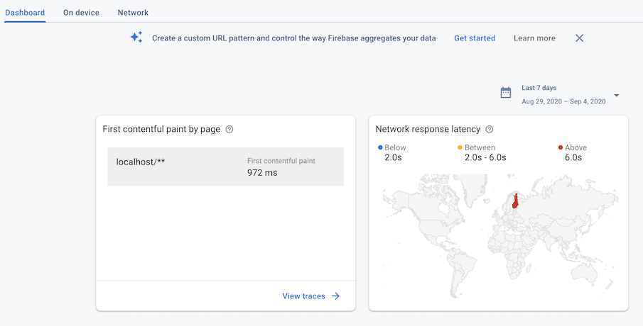

# Ops

Everything that has to do with the life after initial deployment.

There is no single way to do these things, and you may choose to use tools other than us. That's okay.

Firebase ops support looks to be more geared towards mobile apps (iOS, Android) than web apps. Once/if this changes, we may start supporting it but at the moment that would be hackish (e.g. using Google Analytics for central logging).

Here is a comparison table for some tools:

||Firebase|Airbrake|...|
|---|---|---|---|
|Performance Monitoring|yes <font color=green>&check;</font>|not for web|
|Central logging|not really|yes <font color=green>&check;</font>|

<!--
|A/B testing||||
-->

In the future, we may provide support for multiple ops ecosystems (e.g. Airbreak, Datadog, LogRocket, ...) and let you choose which one to create your account on. You should use only one: it brings benefits to have things integrated under one dashboard.

## Requirements

You may continue without creating an extra account and project. In such case, central logging will remain disabled in your project.

### Airbrake

Create an account and a project in [Airbrake](https://airbrake.io).

- The "developer" tier is free and allows 7 days of data retention. <sub>[source](https://airbrake.io/pricing)</sub>

>Details: A complete list of [Airbrake features](https://airbrake.io/docs/features/) (product docs).

<!-- pois
Airbrake covers:

- Errors
- Deploys
- Performance
  - not available for browsers (Sep 2020); hopefully it will become so
-->

### Create an ops configuration file

Create `public/prod.config.js` file that provides your Airbrake id and key. 

>Note: the project id/key are not secret. People having access to your client will be able to figure them out. You may commit them to version control to make it easy for your team to use the project.

```
export default {
  // Airbrake
  ops: {
    projectId: '345678'
    projectKey: '...'
  }
}
```
 


## Performance monitoring

**What we want:**

- performance monitoring of actual use
- stats on end user hardware, resolution, physical screen sizes (desktop/tablet/phone?), browser type and version
- ability to work over offline gaps (i.e. caching)

**Usage:**

[Firebase Performance monitoring](https://firebase.google.com/docs/perf-mon) (in "beta" stage for Web; Sep 2020) is enabled for the production build.

When you do `npm run prod:rollup:serve` or use the deployed instance, performance data should get collected to the Firebase Console.

>Note: "Make sure to keep the browser tab open for at least 10 seconds after the page loads", so that data is shipped. (Firebase docs)

Then, you should see this in the Firebase Console > Performance:


**Now is a good time to read the manuals.** (link above) You really must read them carefully, to understand what to gain from the metrics.

After 24h, you'll see something like this:



<!--
**tbd. what is Performance Monitoring good for?**
-->

**Learning resources:**

- [Faster web apps with Firebase](https://www.youtube.com/watch?v=DHbVyRLkX4c) (Youtube 23:29; Sep 2019)

**Alternatives:**

- (please suggest some, if you have experience)

<!--
- [Airbrake](https://airbrake.io) Performance Monitoring is not available for JavaScript (Sep 2020)
-->


## Central logging

**What we want:**

- centralized, filterable dashboard for seeing client logs
- especially seeing warnings / errors, to help develop the source code
- retention time: 1 week is likely enough
- ability to work over offline gaps (i.e. caching)

Firebase *does not* provide this, as of Sep 2020. Recommendations on Firebase would be using Google Analytics, but we rather turn to a real product, geared at this.

[Airbrake.io](https://airbrake.io) has been selected for this - as you likely guessed. With your identification in the ops config file, logs from clients should get gathered in the Airbrake dashboard.

**Usage:**


**Alternatives:**

- [Datadog](https://www.datadoghq.com)
- [LogRocket](https://logrocket.com)
- (want to suggest others; if you have experience on them)


## Deployment tracking

Airbrake provides more value if it knows when you have done deployments. Check out `tools/prod-deploy-airbrake.sh`, for this purpose.


<!--
- A/B testing
-->


<!--
## References

**tbd. actually good performance monitoring links**
-->

